[](https://www.vaporsoft.dev)
[](https://github.com/corderro-artz/akira)

# Akira

**A cross-platform .NET system state snapshot library.**

Akira captures a complete, point-in-time snapshot of a machine's hardware and software state and returns it as a single, serializable .NET object. Every property is strongly typed, every DTO is immutable, and the entire pipeline is compatible with Native AOT via `System.Text.Json` source generation. Use it for fleet inventory, diagnostics dashboards, change detection, compliance auditing, or anywhere you need a structured view of what a machine looks like right now.

[](https://github.com/corderro-artz/akira/actions/workflows/ci.yml)

[](https://github.com/corderro-artz/akira/releases)
[](https://github.com/corderro-artz/akira/blob/main/LICENSE)
[](https://www.nuget.org/packages/Vaporsoft.Akira)

[](https://dotnet.microsoft.com/)
[](https://github.com/corderro-artz/akira)

## Table of Contents

- [Overview](#overview)
- [Requirements](#requirements)
- [Installation](#installation)
- [Quick Start](#quick-start)
- [Architecture](#architecture)
- [Snapshot Classes](#snapshot-classes)
- [Windows Providers](#windows-providers)
- [API Reference](#api-reference)
- [Development](#development)
- [Deployment](#deployment)
- [Links](#links)
- [Contributing](#contributing)

## Overview

Akira provides 26 snapshot types covering BIOS, CPU, GPU, disks, memory, network adapters, services, processes, and more — totaling over 1,000 strongly-typed properties with full nullable annotations. Platform-specific providers implement a shared `ISnapshotProvider<T>` interface, and a single `MachineSnapshotCollector` aggregates everything into one envelope object with machine identification and collection metadata.

### Capabilities

| Capability | Details |
| --- | --- |
| 26 snapshot types | BIOS, CPU, GPU, disks, memory, network, services, processes, and more |
| 1,000+ properties | Full parity with Win32/WMI class definitions |
| Immutable DTOs | Every property is `{ get; init; }` with full nullable annotations |
| `MachineSnapshot` | One envelope object that bundles everything with metadata and timing |
| `SnapshotResult<T>` | Typed result wrapper with `Ok` / `Fail` / `Unsupported` factory methods |
| AOT-ready | Source-generated `System.Text.Json` serialization — zero reflection |
| Multi-platform | Core DTOs are platform-agnostic; providers are shipped per-platform |

## Requirements

| Requirement | Version | Notes |
| --- | --- | --- |
| .NET | 10.0 or later | SDK and runtime |
| Windows TFM | `net10.0-windows` | Required for `Vaporsoft.Akira.Windows` (WMI / `System.Management`) |
| System.Management | 9.0.3 | Included transitively by the Windows package |

> Linux and macOS provider packages are planned. The core `Vaporsoft.Akira` package has zero additional dependencies.

## Installation

```bash
# Core library (DTOs, interfaces, JSON serialization)
dotnet add package Vaporsoft.Akira

# Windows providers (WMI-based)
dotnet add package Vaporsoft.Akira.Windows
```

## Quick Start

```csharp
using Vaporsoft.Akira;
using Vaporsoft.Akira.Windows;

// Create a WMI executor (the default implementation talks to real WMI)
var wmi = new WmiQueryExecutor();

// Collect a single snapshot
var cpuProvider = new ProcessorSnapshotProvider(wmi);
SnapshotResult<ProcessorSnapshot[]> result = await cpuProvider.GetSnapshotAsync();

if (result.Success)
{
    foreach (var cpu in result.Data!)
        Console.WriteLine($"{cpu.Name} — {cpu.NumberOfCores} cores @ {cpu.MaxClockSpeed} MHz");
}
```

### Serialize to JSON (AOT-safe)

```csharp
using System.Text.Json;

string json = JsonSerializer.Serialize(
    result,
    AkiraJsonContext.Default.SnapshotResultProcessorSnapshotArray);
```

### Collect a complete MachineSnapshot

```csharp
var collector = new MachineSnapshotCollector(new WmiQueryExecutor());
MachineSnapshot snapshot = await collector.CollectAsync();

string json = JsonSerializer.Serialize(snapshot, AkiraJsonContext.Default.MachineSnapshot);
```

`CollectAsync` runs all 26 providers and populates every metadata field (machine name, OS, runtime, version) automatically.

### Build a selective MachineSnapshot

```csharp
var snapshot = new MachineSnapshot
{
    MachineName    = Environment.MachineName,
    CollectedAtUtc = DateTimeOffset.UtcNow,
    Processors     = await new ProcessorSnapshotProvider(wmi).GetSnapshotAsync(),
    BIOS           = await new BIOSSnapshotProvider(wmi).GetSnapshotAsync(),
    DiskDrives     = await new DiskDriveSnapshotProvider(wmi).GetSnapshotAsync(),
    // ... add as many or as few providers as you need
};
```

## Architecture

```text
akira/
├── src/
│   ├── Akira/                  Core DTOs, interfaces, JSON context  (net10.0)
│   ├── Akira.Windows/          WMI-based providers                  (net10.0-windows)
│   ├── Akira.Linux/            procfs / sysfs providers             (planned)
│   └── Akira.MacOS/            IOKit / sysctl providers             (planned)
├── tests/
│   ├── Akira.Tests/            Core DTO and serialization tests
│   └── Akira.Tests.Windows/    Windows provider tests
└── akira.slnx
```

### Data Flow

<picture>
  <source media="(prefers-color-scheme: dark)" srcset="docs/diagrams/data-flow-dark.svg">
  <source media="(prefers-color-scheme: light)" srcset="docs/diagrams/data-flow-light.svg">
  
</picture>

<sub>Source: <a href="docs/diagrams/data-flow.mmd"><code>docs/diagrams/data-flow.mmd</code></a></sub>

Each platform package ships providers that implement `ISnapshotProvider<T>` using native OS APIs. The core `Vaporsoft.Akira` package contains only the DTOs, the interface, `SnapshotResult<T>`, and the AOT-safe JSON serialization context — it has **zero dependencies**.

### Provider Pattern

Every provider follows the same shape:

```csharp
// Singleton (one instance per machine, e.g. BIOS)
public class BIOSSnapshotProvider : WmiSnapshotProvider<BIOSSnapshot> { ... }

// Collection (multiple instances, e.g. disks, adapters)
public class DiskDriveSnapshotProvider : WmiCollectionSnapshotProvider<DiskDriveSnapshot> { ... }
```

Both base classes accept an `IWmiQueryExecutor`, making every provider fully unit-testable without touching real WMI.

## Snapshot Classes

Every snapshot DTO and the native data source used on each platform.

| Snapshot Class | Windows (WMI) | Linux | macOS |
| --- | --- | --- | --- |
| `BaseboardSnapshot` | `Win32_BaseBoard` | `/sys/class/dmi/id/*` | `system_profiler SPHardwareDataType` |
| `BatterySnapshot` | `Win32_Battery` | `/sys/class/power_supply/*` | `ioreg -rc AppleSmartBattery` |
| `BIOSSnapshot` | `Win32_BIOS` | `/sys/class/dmi/id/*` | `system_profiler SPHardwareDataType` |
| `ComputerSystemSnapshot` | `Win32_ComputerSystem` | `hostnamectl` | `system_profiler SPHardwareDataType` |
| `ComputerSystemProductSnapshot` | `Win32_ComputerSystemProduct` | `dmidecode` | `system_profiler SPHardwareDataType` |
| `DesktopMonitorSnapshot` | `Win32_DesktopMonitor` | `xrandr` | `system_profiler SPDisplaysDataType` |
| `DiskDriveSnapshot` | `Win32_DiskDrive` | `lsblk -J` | `diskutil list -plist` |
| `DiskPartitionSnapshot` | `Win32_DiskPartition` | `lsblk -Jp` | `diskutil list -plist` |
| `EnvironmentSnapshot` | `Win32_Environment` | `/proc/self/environ` | `launchctl getenv` |
| `FanSnapshot` | `Win32_Fan` | `/sys/class/hwmon/*/fan*` | SMC via IOKit |
| `LogicalDiskSnapshot` | `Win32_LogicalDisk` | `df`, `/proc/mounts` | `df`, `mount` |
| `NetworkAdapterSnapshot` | `Win32_NetworkAdapter` | `ip link` | `networksetup` |
| `NetworkAdapterConfigurationSnapshot` | `Win32_NetworkAdapterConfiguration` | `ip addr` | `ifconfig`, `scutil` |
| `OperatingSystemSnapshot` | `Win32_OperatingSystem` | `/etc/os-release` | `sw_vers` |
| `PhysicalMemorySnapshot` | `Win32_PhysicalMemory` | `dmidecode -t memory` | `system_profiler SPMemoryDataType` |
| `PrinterSnapshot` | `Win32_Printer` | `lpstat -a` | `lpstat -a` |
| `ProcessSnapshot` | `Win32_Process` | `/proc/[pid]/*` | `sysctl kern.proc` |
| `ProcessorSnapshot` | `Win32_Processor` | `/proc/cpuinfo` | `sysctl hw` |
| `ServiceSnapshot` | `Win32_Service` | `systemctl list-units` | `launchctl list` |
| `SoundDeviceSnapshot` | `Win32_SoundDevice` | `aplay -l` | `system_profiler SPAudioDataType` |
| `StartupCommandSnapshot` | `Win32_StartupCommand` | `systemd-analyze` | `~/Library/LaunchAgents/` |
| `ThermalZoneTemperatureSnapshot` | `MSAcpi_ThermalZoneTemperature` | `/sys/class/thermal/*/temp` | SMC via IOKit |
| `TimeZoneSnapshot` | `Win32_TimeZone` | `timedatectl` | `systemsetup -gettimezone` |
| `UserAccountSnapshot` | `Win32_UserAccount` | `/etc/passwd` | `dscl . -list /Users` |
| `VideoControllerSnapshot` | `Win32_VideoController` | `lspci` | `system_profiler SPDisplaysDataType` |
| `VolumeSnapshot` | `Win32_Volume` | `lsblk -f` | `diskutil info -all -plist` |

## Windows Providers

All 26 Windows providers use WMI via `System.Management`. Most query `root\CIMV2`; thermal zones query `root\WMI`.

| Provider | WMI Class | Type |
| --- | --- | --- |
| `BaseboardSnapshotProvider` | `Win32_BaseBoard` | Singleton |
| `BIOSSnapshotProvider` | `Win32_BIOS` | Singleton |
| `ComputerSystemSnapshotProvider` | `Win32_ComputerSystem` | Singleton |
| `ComputerSystemProductSnapshotProvider` | `Win32_ComputerSystemProduct` | Singleton |
| `OperatingSystemSnapshotProvider` | `Win32_OperatingSystem` | Singleton |
| `TimeZoneSnapshotProvider` | `Win32_TimeZone` | Singleton |
| `BatterySnapshotProvider` | `Win32_Battery` | Collection |
| `DesktopMonitorSnapshotProvider` | `Win32_DesktopMonitor` | Collection |
| `DiskDriveSnapshotProvider` | `Win32_DiskDrive` | Collection |
| `DiskPartitionSnapshotProvider` | `Win32_DiskPartition` | Collection |
| `EnvironmentSnapshotProvider` | `Win32_Environment` | Collection |
| `FanSnapshotProvider` | `Win32_Fan` | Collection |
| `LogicalDiskSnapshotProvider` | `Win32_LogicalDisk` | Collection |
| `NetworkAdapterSnapshotProvider` | `Win32_NetworkAdapter` | Collection |
| `NetworkAdapterConfigurationSnapshotProvider` | `Win32_NetworkAdapterConfiguration` | Collection |
| `PhysicalMemorySnapshotProvider` | `Win32_PhysicalMemory` | Collection |
| `PrinterSnapshotProvider` | `Win32_Printer` | Collection |
| `ProcessorSnapshotProvider` | `Win32_Processor` | Collection |
| `ProcessSnapshotProvider` | `Win32_Process` | Collection |
| `ServiceSnapshotProvider` | `Win32_Service` | Collection |
| `SoundDeviceSnapshotProvider` | `Win32_SoundDevice` | Collection |
| `StartupCommandSnapshotProvider` | `Win32_StartupCommand` | Collection |
| `ThermalZoneTemperatureSnapshotProvider` | `MSAcpi_ThermalZoneTemperature` | Collection |
| `UserAccountSnapshotProvider` | `Win32_UserAccount` | Collection |
| `VideoControllerSnapshotProvider` | `Win32_VideoController` | Collection |
| `VolumeSnapshotProvider` | `Win32_Volume` | Collection |

## API Reference

### `ISnapshotProvider<TSnapshot>`

```csharp
public interface ISnapshotProvider<TSnapshot>
{
    Task<SnapshotResult<TSnapshot>> GetSnapshotAsync(
        CancellationToken cancellationToken = default);
}
```

### `SnapshotResult<T>`

| Property | Type | Description |
| --- | --- | --- |
| `Data` | `T?` | The snapshot data, or `null` on failure |
| `Success` | `bool` | Whether collection succeeded |
| `IsSupported` | `bool` | Whether this type is supported on the current platform |
| `Error` | `string?` | Error message on failure |
| `Warnings` | `string[]?` | Non-fatal warnings |
| `Source` | `string?` | Provider identifier (e.g. `"WMI:Win32_Processor"`) |
| `CollectedAtUtc` | `DateTimeOffset` | UTC timestamp of collection |
| `DurationMs` | `double` | Collection duration in milliseconds |
| `IsPartial` | `bool` | Whether only partial data was returned |

Factory methods:

```csharp
SnapshotResult<T>.Ok(data, source, durationMs)
SnapshotResult<T>.Fail(source, error, durationMs)
SnapshotResult<T>.Unsupported(source)
```

### `MachineSnapshot`

A sealed class that aggregates every `SnapshotResult<T>` into one serializable envelope with machine identification (`MachineName`, `DnsHostName`, `Domain`), OS info (`OsDescription`, `OsVersion`), and collection metadata (`CollectedAtUtc`, `AkiraVersion`).

### `MachineSnapshotCollector`

A convenience class in `Vaporsoft.Akira.Windows` that collects all 26 snapshots and metadata in a single `CollectAsync()` call. Accepts an `IWmiQueryExecutor` and supports `CancellationToken`.

### `AkiraJsonContext`

Pre-configured `System.Text.Json` source-generated context with camelCase naming, indented output, and null-property omission. Includes serialization metadata for all 26 snapshot types and their `SnapshotResult<T>` wrappers.

```csharp
JsonSerializer.Serialize(snapshot, AkiraJsonContext.Default.MachineSnapshot);
JsonSerializer.Deserialize(json, AkiraJsonContext.Default.MachineSnapshot);
```

## Development

```bash
dotnet restore
dotnet build --configuration Release -warnaserror
dotnet test --configuration Release --logger trx --results-directory TestResults
```

## Deployment

- Trigger: creating a [GitHub Release](https://github.com/corderro-artz/akira/releases)
- Workflow: [CI](https://github.com/corderro-artz/akira/actions/workflows/ci.yml) — builds, tests, packs, and publishes on the `release` event
- Targets: [NuGet.org](https://www.nuget.org/packages/Vaporsoft.Akira) and [GitHub Packages](https://github.com/corderro-artz?tab=packages&repo_name=akira)

## Links

| Resource | URL |
| --- | --- |
| Repository | [github.com/corderro-artz/akira](https://github.com/corderro-artz/akira) |
| NuGet — Core | [nuget.org/packages/Vaporsoft.Akira](https://www.nuget.org/packages/Vaporsoft.Akira) |
| NuGet — Windows | [nuget.org/packages/Vaporsoft.Akira.Windows](https://www.nuget.org/packages/Vaporsoft.Akira.Windows) |
| GitHub Packages | [github.com/corderro-artz/akira/packages](https://github.com/corderro-artz?tab=packages&repo_name=akira) |
| Releases | [github.com/corderro-artz/akira/releases](https://github.com/corderro-artz/akira/releases) |
| Issues | [github.com/corderro-artz/akira/issues](https://github.com/corderro-artz/akira/issues) |
| CI / CD | [github.com/corderro-artz/akira/actions](https://github.com/corderro-artz/akira/actions) |
| Vaporsoft | [vaporsoft.dev](https://www.vaporsoft.dev) |

## Contributing

Contributions are welcome. If you'd like to add Linux or macOS providers, open an issue first to discuss the approach.

1. Fork the repository
2. Create a feature branch
3. Write tests for any new providers
4. Submit a pull request

---

Copyright © 2026 [Corderro Artz](https://github.com/corderro-artz) / [Vaporsoft](https://www.vaporsoft.dev).
